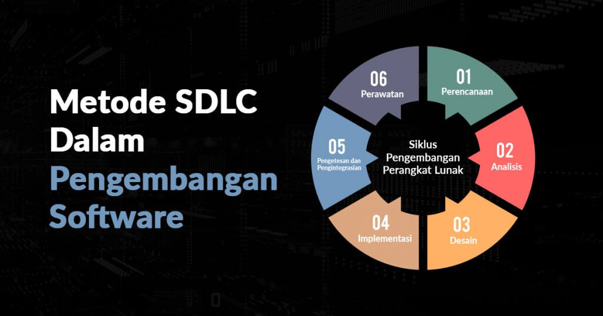
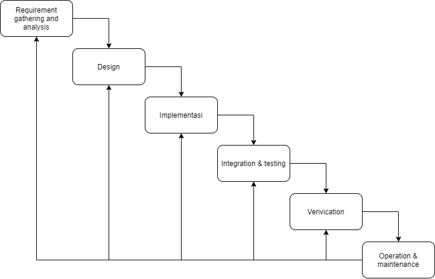
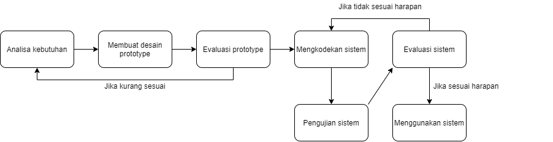
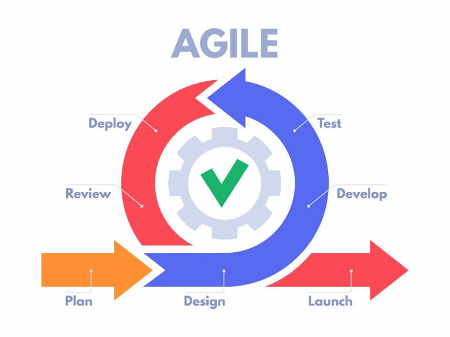
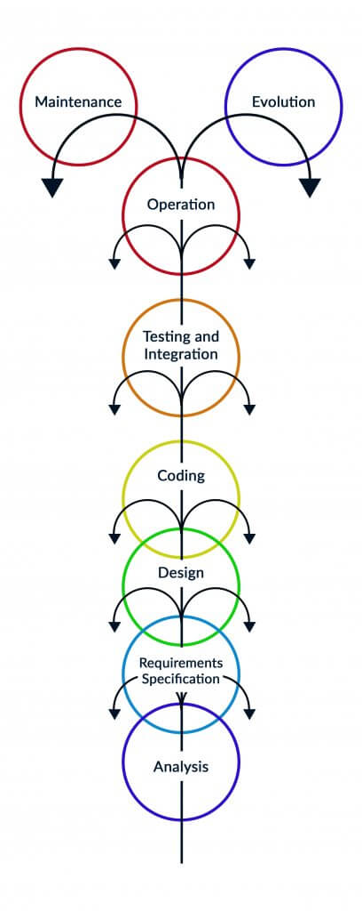

# Metode SDLC Dalam Pengembangan Software

> Sumber: [Metode SDLC](https://www.dicoding.com/blog/metode-sdlc/)

    

Tahukah kamu apa itu **metode SDLC**? Metode SDLC (_Software Development Life Cycle_) adalah proses pembuatan dan pengubahan sistem serta model dan metodologi yang digunakan untuk mengembangkan sistem rekayasa perangkat lunak. Metode SDLC hadir untuk membantu kamu dalam pengembangan produk. Metode ini memiliki banyak jenisnya, tapi di sini kita fokus membahas 4 metode saja ya. Berikut adalah 4 metode SDLC dalam pengembangan software.

## Waterfall

    

Metode SDLC yang pertama adalah waterfall. Metode waterfall adalah metode kerja yang menekankan fase-fase yang berurutan dan sistematis. Disebut waterfall karena proses mengalir satu arah “ke bawah” seperti air terjun. Metode waterfall ini harus dilakukan secara berurutan sesuai dengan tahap yang ada.

Berikut adalah tahap-tahap pengembangan dalam metode waterfall.

- **Requirement gathering and analysis** 
                        
    Mengumpulkan kebutuhan secara lengkap untuk dianalisis dan mendefinisikan kebutuhan apa saja yang harus dicapai oleh program. Informasi dapat diperoleh melalui wawancara, diskusi, atau survey.

- **Design**

    Melakukan perancangan desain perangkat lunak sebagai perkiraan sebelum dibuatnya kode. Desain sistem dapat dibuat menggunakan Flowchart, Mind Map, atau Entity Relationship Diagram (ERD).

- **Implementasi**
 
    Implementasi ini adalah tahap dimana seluruh desain yang sebelumnya sudah dibuat diubah menjadi kode-kode program. Kode yang dihasilkan masih berbentuk modul-modul yang harus digabungkan di tahap selanjutnya.

- **Integration & testing**
  
    Di tahap ini dilakukan penggabungan modul-modul yang sudah dibuat sebelumnya dan melakukan pengujian untuk mengetahui apakah perangkat lunak yang dibuat telah sesuai dengan desain dan fungsinya atau tidak.

- **Verification**

    Di tahap ini, pengguna atau klien yang langsung melakukan pengujian pada sistem, apakah sistem telah sesuai dengan yang disetujui atau belum sesuai.

- **Operation & maintenance**

    Tahap ini merupakan tahap terakhir dari model waterfall. Sistem yang sudah selesai dijalankan serta dilakukan pemeliharaan. Pemeliharaan berupa memperbaiki kesalahan yang tidak ditemukan pada langkah sebelumnya.

Setiap metode yang digunakan pasti memiliki kelebihan serta kekurangannya tersendiri.

Berikut adalah kelebihan dari metode waterfall:

1. Memiliki proses yang terurut, sehingga pengerjaan dapat terjadwal dengan baik dan mudah.
2. Cocok untuk sistem dengan kompleksitas rendah (predictable).
3. Setiap proses yang dilakukan tidak dapat saling tumpah tindih.

4. Berikut adalah kekurangan dari metode waterfall:

1. Waktu pengerjaan relatif lebih lama, karena harus menunggu tahap sebelumnya selesai.
2. Biaya yang dibutuhkan lebih mahal karena waktu pengembangan yang dibutuhkan lebih lama.
3. Model waterfall ini kurang cocok untuk pengembangan proyek yang memiliki kompleksitas tinggi.

## Prototype

    

Metode SDLC selanjutnya adalah prototype. Metode prototype adalah metode yang memungkinkan pengguna atau user memiliki gambaran awal tentang perangkat lunak yang akan dikembangkan, serta pengguna dapat melakukan pengujian di awal sebelum perangkat lunak dirilis.

Metode ini bertujuan untuk mengembangkan model menjadi perangkat lunak yang final. Artinya sistem akan dikembangkan lebih cepat dan biaya yang dikeluarkan lebih rendah. Metode prototype ini memiliki tahap-tahap yang harus dilakukan dalam pengembangan perangkat lunak.

Berikut adalah tahap-tahap pengembangan perangkat lunak menggunakan metode prototype.

- **Analisa kebutuhan**

    Pada tahap ini pengembang melakukan identifikasi perangkat lunak dan semua kebutuhan sistem yang akan dibuat.

- **Membuat prototype**

    Membuat rancangan sementara yang berfokus pada alur program kepada pengguna.

- **Evaluasi prototype**

    Evaluasi dilakukan untuk mengetahui apakah model prototype sudah sesuai dengan harapan.

- **Mengkodekan sistem**

    Jika prototype disetujui maka akan diterjemahkan ke dalam bahasa pemrograman yang sesuai.

- **Pengujian sistem**

    Setelah perangkat lunak sudah siap, perangkat lunak harus melewati pengujian. Pengujian ini biasanya dilakukan dengan White Box Testing, Black Box Testing, dan lain-lain.

- **Evaluasi sistem**

    Pengguna melakukan evaluasi apakah perangkat lunak sudah sesuai dengan apa yang diharapkan atau tidak. Jika ya, lakukan tahap selanjutnya. Jika tidak, ulangi tahap mengkodekan sistem dan pengujian sistem.

- **Menggunakan sistem**

    Perangkat lunak yang telah diuji dan disetujui siap untuk digunakan.
Sebagai suatu metode yang sering digunakan, metode prototype pasti memiliki kelebihan dan kekurangan.

Berikut adalah kelebihan dari metode prototype:

1. Mempersingkat waktu pengembangan perangkat lunak
2. Penerapan fitur menjadi lebih mudah, karena pengembang mengetahui apa yang diharapkan

Berikut adalah kekurangan dari metode prototype:

1. Proses yang dilakukan untuk analisis dan perancangan terlalu singkat
2. Kurang fleksibel jika terjadi perubahan

## Agile

    

Metode SDLC ketiga adalah agile. Metode agile adalah metode yang fleksibel di mana pengembangan dilakukan dalam jangka pendek. Namun diperlukan adaptasi yang cepat dari developer terhadap perubahan dalam bentuk apa pun.

Berikut merupakan tujuan dari agile, antara lain:

- **High – value & working app system**

    Menghasilkan produk dengan kualitas yang baik, dan memiliki nilai jual yang tinggi.

- **Iterative, incremental, evolutionary**

    Pengembangan dapat dilakukan secara iteratif, berulang-ulang, dan dapat mengalami perubahan jika diperlukan.

- **Cost control & value – driven development**

    Pengembangan perangkat lunak dapat sesuai dengan kebutuhan pengguna dan tim dapat dengan cepat merespon kebutuhan, sehingga waktu dan biaya pembuatan dari perangkat lunak dapat dikendalikan.

- **High – quality production**

    Kualitas dari perangkat lunak tetap terjaga, meskipun waktu dan biaya lebih sedikit.

- **Flexible & risk management**

    Meminimalisir terjadinya kesalahan pada program ataupun produk sebelum dilakukannya proses deploy aplikasi.

- **Collaboration**

    Kolaborasi ini dilakukan oleh setiap tim pengembang untuk mendiskusikan feedback yang diberikan oleh klien.

- **Self – organizing, self – managing teams**

    Pengembang diberikan akses untuk memanajemen sendiri urusan software development. Seorang manajer hanya bertugas sebagai penghubung antara pengembang dengan klien sehingga dapat mengurangi terjadinya miss communication.
- 
Metode agile ini memiliki kelebihan dan kekurangan tersendiri.

Berikut adalah kelebihan dari metode agile:

1. Perubahan dapat dengan cepat ditangani.
2. Proses pengembangan perangkat lunak membutuhkan waktu yang relatif cepat dan tidak memerlukan sumber daya yang besar.
3. Klien dapat memberikan feedback kepada pengembang dalam proses pembuatan program.

Berikut adalah kekurangan dari metode agile:

1. Metode ini kurang sesuai dengan tim yang besar (lebih dari 20 orang).
2. Tim harus selalu siap, karena perubahan dapat terjadi kapan saja.
3. Metode ini kurang cocok untuk tim yang berkomitmen untuk menyelesaikan proyek bersama-sama.

## Fountain

    

Metode SDLC yang terakhir adalah fountain. Metode fountain adalah perbaikan dari metode waterfall, di mana jenis tahapan masih sama. Namun beberapa jenis tahapan boleh didahulukan atau dilewati, tetapi ada tahapan yang tidak bisa dilewati, contohnya seperti kamu memerlukan design sebelum melakukan implementasi, jika hal tersebut dilewati maka akan ada tumpang tindih.

Berikut adalah tahap-tahap pengembangan perangkat lunak menggunakan metode fountain.

- **User requirement specification**

    Mencari tahu apa saja yang dibutuhkan oleh pengguna dalam perangkat lunak yang sedang dikembangkan.

- **Software requirement specification**

    Penyesuaian perangkat lunak dari sisi pengguna.

- **System design**

    Pembuatan desain sistem yang akan dibuat sebelum diimplementasikan.

- **Program design**

    Pembuatan desain yang lebih sempurna dan hampir mendekati hasil akhir dari perangkat lunak.

- **Implementation**

    Di tahap ini dilakukan implementasi sesuai dengan desain yang sudah dibuat di tahap sebelumnya.

- **Program testing: unit**

    Dalam tahap ini dilakukan uji coba terhadap unit-unit yang dibutuhkan dalam perangkat lunak yang dikembangkan.

- **Program testing: system**

    Di tahap ini dilakukan uji coba terhadap sistem dari perangkat lunak seutuhnya sebelum perangkat lunak digunakan.

- **Program use**

    Dalam tahap ini dilakukan pengajaran kepada pengguna untuk menggunakan perangkat lunak yang telah dibuat.

- **Software maintenance**

    Biasanya dalam tahap ini dilakukan perawatan terhadap perangkat lunak yang sudah dibuat, perawatan dapat berupa update sistem atau perbaikan kesalahan atau bugs yang ada.

Karena metode fountain ini adalah perbaikan dari metode waterfall, maka metode ini memiliki kelebihan dan kekurangan yang mirip dengan metode waterfall.

Berikut adalah kelebihan dari metode fountain:

1. Memiliki proses yang terurut, sehingga pengerjaan dapat terjadwal dengan baik dan mudah.
2. Cocok untuk sistem dengan kompleksitas rendah (predictable).
3. Dapat melewati atau mendahulukan beberapa tahapan .
4. Setiap proses yang dilakukan tidak dapat saling tumpah tindih.

Berikut adalah kekurangan dari metode waterfall:

1. Waktu pengerjaan relatif lebih lama, karena harus menunggu tahap sebelumnya selesai.
2. Biaya yang dibutuhkan lebih mahal karena waktu pengembangan yang dibutuhkan lebih lama.
3. Model fountain ini kurang cocok untuk pengembangan proyek yang memiliki kompleksitas tinggi.

Jadi, sekarang kamu sudah tahu kan apa saja metode SDLC yang digunakan dalam pengembangan perangkat lunak? Dalam penggunaannya setiap tim pasti menerapkan metode yang berbeda-beda untuk mengembangkan suatu perangkat lunak karena setiap metode memiliki kelebihan dan kekurangannya masing-masing.

Semoga dengan mengetahui kelebihan dan kekurangan dari masing-masing metode kamu dan tim kamu dapat menggunakan metode yang sesuai untuk mengembangkan suatu program.

**Metode SDLC Dalam Pengembangan Software – end**

Baca juga artikel pilihan berikut ini :

1. [Contoh Use Case Diagram Lengkap dengan Penjelasannya](https://www.dicoding.com/blog/contoh-use-case-diagram/)
2. [Apa itu UML? Beserta Pengertian dan Contohnya](https://www.dicoding.com/blog/apa-itu-uml/)
3. [Apa itu Activity Diagram? Beserta Pengertian, Tujuan, Komponen](https://www.dicoding.com/blog/apa-itu-activity-diagram/)